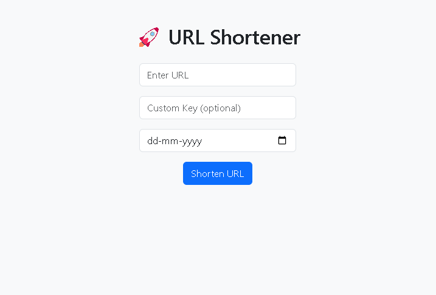

## 🌍 **Go URL Shortener**  
A simple yet powerful **URL shortener** built with **Go (Golang)** and **BoltDB**, featuring a **modern Bootstrap UI** for easy interaction.  

   

---

### 🔥 **Features**  
✅ **Shorten long URLs** in seconds  
✅ **Custom short links** (optional)  
✅ **Expiration time** for short links  
✅ **Click tracking & analytics**  
✅ **Fast & lightweight** (Uses BoltDB – no SQL required)  
✅ **Modern UI** (Bootstrap-powered)  

---

### 🚀 **Tech Stack**  
- **Go (Golang)** 🐹  
- **BoltDB** (Embedded key-value store) 🔐  
- **Bootstrap 5** (Responsive UI) 🎨  
- **Net/HTTP** (Standard library for routing)  

---

### 📂 **Project Structure**  
```
📁 URL-Shortener/
│── 📄 main.go          # Backend logic (shortening, redirecting)
│── 📄 go.mod           # Go module dependencies
│── 📁 static/          # Frontend files (HTML, CSS, JS)
│   ├── 📄 index.html   # Homepage UI
│   ├── 📄 styles.css   # Custom styles
│── 📄 urls.db          # Database file (created at runtime)
```

---

### 🛠 **Installation & Setup**  
#### 1️⃣ **Clone the Repository**  
```bash
git clone https://github.com/RohanCyberOps/URL-Shortener.git
cd URL-Shortener
```

#### 2️⃣ **Install Dependencies**  
Ensure you have **Go 1.24+** installed.  
```bash
go mod tidy
```

#### 3️⃣ **Run the Server**  
```bash
go run main.go
```
🚀 Now, visit **[http://localhost:8080](http://localhost:8080)** in your browser!  

---

### ⚡ **Usage**  
#### 🔗 **Shorten a URL**  
1️⃣ Enter a long URL in the input box.  
2️⃣ (Optional) Provide a **custom short key** or leave it blank for auto-generation.  
3️⃣ Click **Shorten** and get your **short URL**!  

#### 🔄 **Redirecting**  
- Access your **shortened link** (e.g., `http://localhost:8080/abc123`).  
- It will **automatically redirect** to the original long URL.  

#### 📊 **Track Clicks & Expiry**  
- Click tracking is **automatically updated** in the database.  
- Expired links **will not be accessible**.  

---

### 🎯 **To-Do / Future Enhancements**  
🔹 Add **QR code** generation  
🔹 Implement a **user dashboard** for link management  
🔹 Deploy to **Vercel / Render / DigitalOcean**  

---

### 📜 **License**  
This project is **open-source** and available under the **MIT License**.  

---

### 💡 **Contributing**  
👨‍💻 Pull requests are welcome! Feel free to **fork** this repository and enhance it.  

---

📧 **Need Help?** Contact me via [GitHub](https://github.com/RohanCyberOps). 🚀
